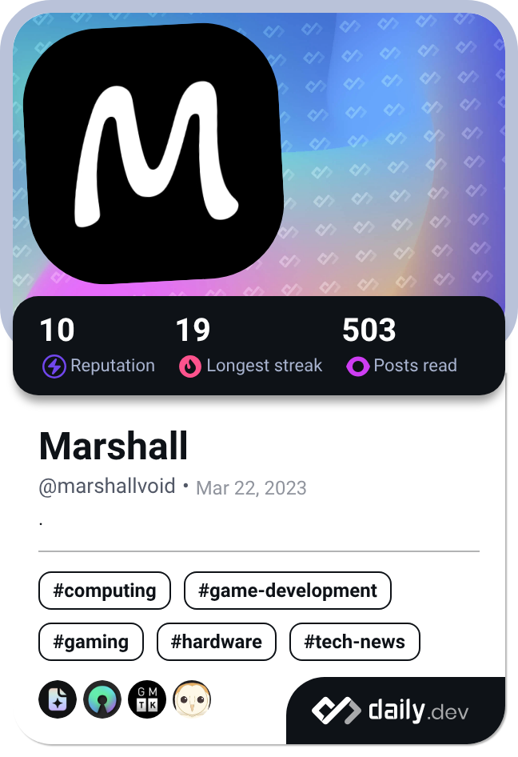

  

---

 

### 🔰 About Me 🔰
- 👋 Hi, I'm **Marshall**
- 📚 I'm currently self-learning to become a **Software Engineer**
- 📫 Feel free to reach out via email: [hieptt.dev@gmail.com](mailto:hieptt.dev@gmail.com)

### ⚡ Languages and Tools ⚡

  

 
