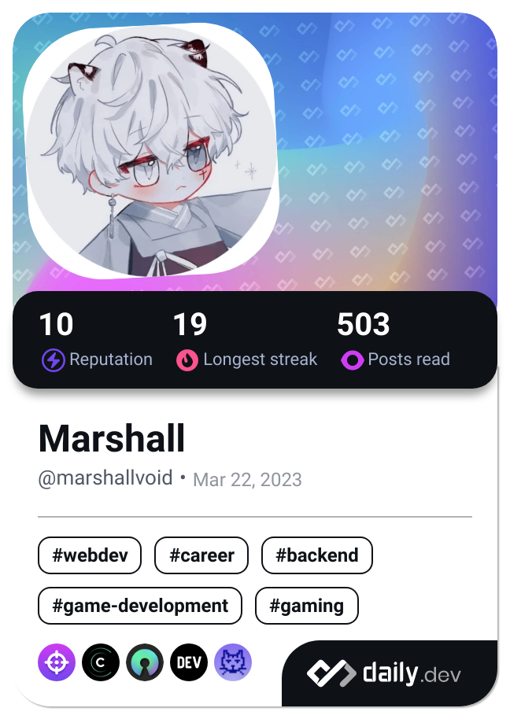

<!-- Header -->

---

 

<!-- Description -->
<!-- ### 🔰 About me 🔰
- 👋 Hi, I'm **Devlin**
- 📚 I’m currently learning **Software Engineer** by self
- 📫 [This is my email](mailto:hieptt.dev@gmail.com)
-->

<!-- Technologies -->
### ⚡ Languages and Tools ⚡

  

 
